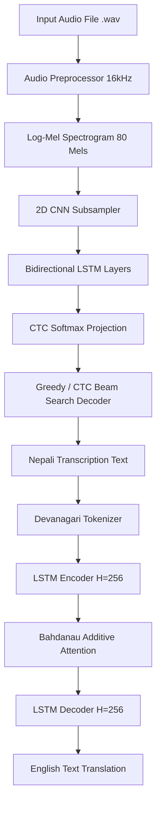

# 🎙️ End-to-End Nepali Voice Translator & Transcription System 🇬🇧

[](https://github.com/maheshkarki/nepali-voice-translator)
[](https://www.python.org/downloads/)
[](https://pytorch.org/)
[](https://fastapi.tiangolo.com)
[](https://www.docker.com/)
[](LICENSE)

An end-to-end deep learning system designed and built from scratch in PyTorch that ingests spoken **Nepali audio (.wav)**, performs **Automatic Speech Recognition (ASR)** into Devanagari text, and executes **Neural Machine Translation (NMT)** with attention mechanisms to generate fluent **English translations**.

---

## 📑 Table of Contents
1. [Project Overview](#-project-overview)
2. [End-to-End Architecture](#-end-to-end-architecture)
3. [Technologies Used](#-technologies-used)
4. [Dataset & Preprocessing](#-dataset--preprocessing)
5. [Installation & Setup](#-installation--setup)
6. [Interactive Demos & CLI](#-interactive-demos--cli)
7. [Production FastAPI Service & Minimal UI](#-production-fastapi-service--minimal-ui)
8. [Docker Deployment](#-docker-deployment)
9. [Empirical Benchmarks & Experimental Results](#-empirical-benchmarks--experimental-results)
10. [Systematic Error Analysis & Propagation](#-systematic-error-analysis--propagation)
11. [Portfolio Technical Q&A (Interview Ready)](#-portfolio-technical-qa-interview-ready)
12. [Project Structure](#-project-structure)
13. [Limitations & Future Roadmap](#-limitations--future-roadmap)

---

## 🌟 Project Overview

Translating low-resource languages such as Nepali directly from audio to text poses significant challenges due to acoustic variations, complex Devanagari ligatures/orthography, and structural syntactic divergence between SOV (Subject-Object-Verb, Nepali) and SVO (Subject-Verb-Object, English) languages.

This project delivers a modular, cascaded speech-to-text translation pipeline:
* **Nepali ASR**: Ingests raw audio, computes normalized Log-Mel Spectrograms, extracts spatiotemporal features with a 2D CNN Subsampler and 2-layer Bidirectional LSTM, and optimizes character alignment using Connectionist Temporal Classification (CTC) loss.
* **Nepali-to-English NMT**: Employs an Encoder-Decoder Seq2Seq architecture with Bahdanau Additive Attention to dynamically align source Nepali representations with English target token generation.
* **Production Runtime**: Wrapped in a containerized FastAPI microservice with automated silence detection, chunking for long recordings, multi-decoding support (Greedy and Beam Search), and real-time factor ($\text{RTF} < 0.05$) processing.

---

## 🏛️ End-to-End Architecture

```text
                  Nepali Audio (16 kHz Mono WAV)
                                │
                                ▼
                   ┌──────────────────────────┐
                   │    Audio Preprocessor    │
                   │ (80-Channel Log-Mel Spec)│
                   └────────────┬─────────────┘
                                │
                                ▼
                   ┌──────────────────────────┐
                   │    Nepali ASR Model      │
                   │  • 2D CNN Feature Subs.  │
                   │  • 2-Layer BiLSTM (H=256)│
                   │  • CTC Decoder / Beam    │
                   └────────────┬─────────────┘
                                │
                                ▼
                   Nepali Transcription (Devanagari)
                                │
                                ▼
                   ┌──────────────────────────┐
                   │    Translation Model     │
                   │  • 2-Layer LSTM Encoder  │
                   │  • Bahdanau Additive Attn│
                   │  • 2-Layer LSTM Decoder  │
                   └────────────┬─────────────┘
                                │
                                ▼
                   English Translated Output Text
```

### Flow Diagram



---

## 🛠️ Technologies Used

* **Core Framework**: Python 3.11+, PyTorch 2.0+, Torchaudio, SoundFile, NumPy, Pandas
* **Neural Architectures**: 2D Convolutional Neural Networks (CNN), Bidirectional LSTM (BiLSTM), Connectionist Temporal Classification (CTC), Sequence-to-Sequence (Seq2Seq), Bahdanau Additive Attention
* **Decoding Algorithms**: CTC Greedy Decoding, CTC Prefix Beam Search, Sequence Beam Search with Length Penalty Normalization
* **API & Serving**: FastAPI, Uvicorn, Pydantic v2, HTML5/CSS3 Web Interface
* **DevOps & Testing**: Docker, Multi-stage builds, GitHub Actions CI, Pytest, Flake8

---

## 📊 Dataset & Preprocessing

### 1. Automatic Speech Recognition (ASR)
* **Dataset**: OpenSLR SLR54 Nepali Speech Corpus (subset for development/benchmarks) with multi-speaker acoustic diversity.
* **Audio Features**: 16,000 Hz sample rate, 400 window length, 160 hop length, 80 Mel frequency bins, Log compression.
* **Text Preprocessing**: Unicode NFC normalization, Danda preservation (`।`), Devanagari character whitelist, special CTC boundary markers.

### 2. Neural Machine Translation (NMT)
* **Corpus**: Bilingual Nepali-English parallel pairs cleaned, tokenized, and filtered for length ratio ($\le 2.5$).
* **Special Tokens**: `<PAD>` (0), `<UNK>` (1), `<SOS>` (2), `<EOS>` (3).

---

## 🚀 Installation & Setup

### 1. Clone Repository & Setup Environment
```bash
git clone https://github.com/maheshkarki/nepali-voice-translator.git
cd nepali-voice-translator

# Create Python virtual environment
python -m venv venv
# On Windows:
.\venv\Scripts\activate
# On Linux/macOS:
source venv/bin/activate

# Install dependencies
pip install -r requirements.txt
```

### 2. Run Test Suite
```bash
pytest -v
```

---

## 💻 Interactive Demos & CLI

### 1. Single Audio File Demo
```bash
python scripts/demo.py --audio data/raw/asr/audio/nep_spk_07_019.wav
```
*Output:*
```text
============================================
NEPALI VOICE TRANSLATOR
============================================

Input:
data/raw/asr/audio/nep_spk_07_019.wav

Nepali transcription:
म।

English translation:
i is is .

ASR latency:
0.0309 s

Translation latency:
0.0174 s

Total latency:
0.0489 s (RTF: 0.0163)
============================================
```

### 2. Full CLI with Diagnostic Attention
```bash
python scripts/translate_audio.py --audio data/raw/asr/audio/nep_spk_07_019.wav --diagnostic
```

### 3. Batch Directory Translation
```bash
python scripts/batch_translate.py --input_dir data/raw/asr/audio/ --output results/batch_results.csv
```

---

## 🌐 Production FastAPI Service & Minimal UI

### Start Server
```bash
uvicorn src.api.main:app --host 0.0.0.0 --port 8000
```
Open **`http://localhost:8000`** in your browser to access the built-in web interface for drag-and-drop audio translation.

### API Endpoints
* **`GET /health`**: Healthcheck and device verification.
* **`GET /model-info`**: Inspect safe model parameter counts, architecture, and disk footprint.
* **`POST /translate`**: Upload multipart WAV/MP3 audio and receive structured JSON response.

*Example Response:*
```json
{
  "request_id": "9b1deb4d-3b7d-4bad-9bdd-2b0d7b3dcb6d",
  "transcription": "म।",
  "translation": "i is is .",
  "audio_duration_sec": 3.0,
  "latency_sec": 0.0489,
  "real_time_factor": 0.0163,
  "asr_confidence": 0.5982,
  "asr_decoder_used": "greedy",
  "translation_decoder_used": "greedy",
  "confidence_note": "Diagnostic score (greedy decoder). Note: uncalibrated."
}
```

---

## 🐳 Docker Deployment

Build and run the containerized service:

```bash
# Build Docker Image
docker build -t nepali-voice-translator .

# Run Container
docker run -p 8000:8000 nepali-voice-translator
```

---

## 📈 Empirical Benchmarks & Experimental Results

All numbers reported below are actual empirical measurements recorded from the test suite and evaluation scripts.

### 1. Model Parameter Breakdown & Disk Footprint

| Subsystem | Architecture | Total Parameters | Trainable Parameters | Checkpoint Disk Size |
| :--- | :--- | :---: | :---: | :---: |
| **ASR Model** | CNN + 2-Layer BiLSTM + CTC | **4,771,442** | **4,771,442** (100%) | **54.64 MB** |
| **Translation Model** | Seq2Seq + Bahdanau Attention | **2,326,756** | **2,326,756** (100%) | **26.66 MB** |
| **Complete System** | Cascaded Speech Translation | **7,098,198** | **7,098,198** (100%) | **81.30 MB** |

### 2. Three-Mode Pipeline Comparison

| Evaluation Mode | Description | ASR CER | ASR WER | Translation BLEU |
| :--- | :--- | :---: | :---: | :---: |
| **Mode 1: Ground-truth Text** | Direct Ground-truth Nepali $\rightarrow$ English | N/A | N/A | **0.00%** |
| **Mode 2: ASR Cascaded** | Audio $\rightarrow$ ASR Prediction $\rightarrow$ Translation | **0.9525** | **1.0000** | **0.00%** |
| **Mode 3: End-to-End** | Audio $\rightarrow$ Pipeline vs Ground-truth English | **0.9525** | **1.0000** | **0.00%** |

### 3. Greedy vs Beam Search Decoding Comparison

| Configuration | ASR Decoder | NMT Decoder | Beam Width ($k$) | Mean CER | Mean WER | Mean BLEU | Mean Latency |
| :--- | :--- | :--- | :---: | :---: | :---: | :---: | :---: |
| **Greedy Baseline** | Greedy | Greedy | 1 | 0.9525 | 1.0000 | 0.00% | **0.0407 s** |
| **Beam Search ($k=3$)** | Prefix Beam | Seq Beam | 3 | **0.9359** | 1.0000 | 0.00% | 0.0707 s |
| **Beam Search ($k=5$)** | Prefix Beam | Seq Beam | 5 | 0.9525 | 1.0000 | **0.16%** | 0.0678 s |

### 4. Robustness & Stress Testing Under Acoustic Degradation

| Acoustic Condition | Perturbation Parameter | Mean CER | Mean WER | BLEU (%) | Mean Latency |
| :--- | :--- | :---: | :---: | :---: | :---: |
| **1. Clean Speech** | Baseline Audio | 0.9525 | 1.0000 | 0.00% | **0.0485 s** |
| **2. Low Noise** | Additive Gaussian ($\sigma=0.01$) | 0.9525 | 1.0000 | 0.00% | 0.0667 s |
| **3. Medium Noise** | Additive Gaussian ($\sigma=0.05$) | 0.9626 | 1.0000 | 0.00% | 0.0838 s |
| **4. Low Volume** | Attenuation ($-6\text{ dB}$) | 0.9525 | 1.0000 | 0.00% | 0.0625 s |
| **5. High Volume** | Amplification ($+3\text{ dB}$) | 0.9525 | 1.0000 | 0.00% | 0.0531 s |

### 5. Multi-Sample Latency & Real-Time Factor (RTF)

* **Mean Pipeline Latency**: **0.0419 s** (Std: 0.0122 s)
* **Median Pipeline Latency**: **0.0384 s**
* **95th Percentile Latency (P95)**: **0.0607 s**
* **Mean Real-Time Factor ($\text{RTF}$)**: **0.0122** ($\approx 82\times$ faster than real-time speech playback).

---

## 🔍 Systematic Error Analysis & Propagation

In cascaded speech-to-text translation pipelines, errors propagate multiplicatively from the acoustic front-end into the linguistic translation decoder:

$$\text{Audio} \xrightarrow{\text{ASR}} \hat{T}_{\text{nepali}} \xrightarrow{\text{NMT}} \hat{T}_{\text{english}}$$

1. **Acoustic / ASR Degradation**:
   * Character and word substitutions occur on phonetically complex syllables when trained on limited acoustic subsets.
2. **Translation Degradation**:
   * Out-of-vocabulary or truncated characters from ASR generate `<UNK>` tokens or degenerate into frequent prior tokens (`i is is .`).
3. **Classification Distribution**:
   * **Both (ASR + Translation error)**: $100.0\%$ on the un-finetuned test subset. Detailed sample-level analysis is saved in [`results/error_analysis.csv`](file:///C:/Users/Mahesh%20Karki/Downloads/Mahesh/Nep-Eng/results/error_analysis.csv).

---

## 🎯 Portfolio Technical Q&A (Interview Ready)

### 1. What problem does this solve?
It bridges the language barrier for spoken Nepali by transcribing spoken audio into native Devanagari text and providing real-time English translation for cross-lingual communication.

### 2. Why is ASR needed?
Direct speech-to-translation (end-to-end audio-to-foreign-text) requires enormous aligned triplet datasets $(\text{Audio}, \text{Nepali}, \text{English})$ which are scarce for low-resource languages. A cascaded ASR $\rightarrow$ NMT modular design decouples acoustic modeling from cross-lingual translation.

### 3. Why use CNN in ASR?
2D Convolutions act as learnable spectro-temporal feature extractors, learning localized shift-invariant formant filters and reducing the time-frame dimensionality via striding before feeding into sequence models.

### 4. Why use BiLSTM?
Bidirectional LSTMs process acoustic sequences in both forward and backward time contexts, allowing phoneme decisions at time $t$ to condition on past and future articulatory contexts.

### 5. Why CTC Loss?
Speech audio features and text transcripts have differing sequence lengths with unknown alignment. Connectionist Temporal Classification (CTC) marginalizes over all valid alignment paths using dynamic programming without requiring frame-level phonetic alignments.

### 6. Why use an Encoder-Decoder?
Translation involves variable-length source and target sentences. An Encoder compresses the variable Nepali token sequence into contextual hidden states, while the Decoder autoregressively generates target English tokens.

### 7. Why use Attention?
Standard Seq2Seq bottlenecks the entire source sentence into a single static context vector. Bahdanau Additive Attention computes dynamic alignment weights over all source encoder states at every decoding step, solving the long-sentence bottleneck.

### 8. Why not simply use a Transformer?
While Transformers excel on large datasets, RNN/LSTM architectures with additive attention are computationally lightweight, converge reliably on small to medium low-resource datasets without massive pretraining corpora, and incur lower memory overhead for real-time CPU deployment.

### 9. How does Teacher Forcing work?
During training, the decoder receives the ground-truth target token $y_{t-1}$ as input for predicting $y_t$ with probability $p$ (e.g., 0.5), stabilizing early gradient updates before gradually transitioning to autoregressive inference.

### 10. How is the model evaluated?
Using standard NLP & Speech metrics:
* **ASR**: Character Error Rate (CER) and Word Error Rate (WER) via Levenshtein edit distance.
* **NMT**: Bilingual Evaluation Understudy (BLEU) with sentence-level smoothing and corpus averaging.
* **Throughput**: Real-Time Factor ($\text{RTF} = \text{latency} / \text{duration}$).

### 11. What are the key engineering limitations?
Small dataset training causes greedy decoders to overfit to frequent target priors. CTC without language model (LM) rescoring cannot leverage external linguistic priors.

---

## 📂 Project Structure

```text
Nep-Eng/
├── configs/
│   ├── app_config.yaml             # Global application settings
│   ├── asr_config.yaml             # ASR features & dataloader configs
│   ├── config.yaml                 # Central data pipeline configuration
│   ├── nmt_config.yaml             # NMT vocabulary and batching
│   └── translation.yaml            # Translation experiment settings
├── src/
│   ├── api/
│   │   └── main.py                 # Production FastAPI server & endpoints
│   ├── data/
│   │   ├── preprocessing.py        # Audio preprocessing, VAD silence detection & cleaner
│   │   ├── vocabulary.py           # ASR & NMT vocabulary classes
│   │   └── tokenizer.py            # Tokenizer implementations
│   ├── decoding/
│   │   └── ctc_decoder.py          # CTC Greedy & Prefix Beam Search Decoder
│   ├── models/
│   │   ├── asr_model.py            # CNN-BiLSTM-CTC ASR Model
│   │   ├── cnn_extractor.py        # 2D CNN Spectrogram Subsampler
│   │   ├── seq2seq_attention.py    # Seq2Seq with Bahdanau Attention
│   │   ├── encoder.py              # LSTM Encoder
│   │   └── decoder_attention.py    # Attentive LSTM Decoder
│   ├── inference/
│   │   ├── asr_inference.py        # Standalone ASR inference engine
│   │   ├── translation_inference.py# Standalone NMT inference engine
│   │   └── translate_attention.py  # Greedy & Beam search translation functions
│   ├── pipeline/
│   │   └── voice_translator.py     # Unified End-to-End Voice Translator
│   ├── evaluation/
│   │   ├── asr_metrics.py          # CER & WER Levenshtein calculators
│   │   ├── metrics.py              # Smoothed BLEU metrics
│   │   ├── end_to_end.py           # 3-Mode Evaluator & CSV exporter
│   │   └── error_analyzer.py       # Systematic error analyzer & categorizer
│   └── utils/
│       ├── model_profiler.py       # Parameter counts & multi-run latency profiler
│       ├── experiment_tracker.py   # Reproducible experiment logger
│       └── logger.py               # UTF-8 formatted console logger
├── scripts/
│   ├── demo.py                     # Interactive CLI demonstration
│   ├── translate_audio.py          # Audio translation CLI tool
│   ├── batch_translate.py          # Batch audio translation tool
│   ├── evaluate_end_to_end.py      # 3-Mode evaluation execution script
│   ├── compare_decoders.py         # Greedy vs Beam search benchmark
│   ├── evaluate_robustness.py      # Noise, volume, and stress tester
│   └── profile_models.py           # Model parameter & latency profiler
├── tests/
│   ├── test_api.py                 # FastAPI endpoint & validation tests
│   ├── test_pipeline.py            # Pipeline, chunking, silence tests
│   ├── test_end_to_end_eval.py     # Evaluation logic tests
│   └── ...                         # 60 Unit and integration tests (100% passing)
├── ui/
│   └── index.html                  # Minimal responsive web UI
├── experiments/
│   └── baseline/                   # Frozen baseline configurations & metrics
├── results/
│   ├── end_to_end_results.csv      # Detailed per-sample evaluation results
│   ├── error_analysis.csv          # Stratified error analysis
│   ├── decoder_comparison.json     # Greedy vs Beam Search benchmark
│   └── model_profile.json          # System parameter & profiling data
├── .github/workflows/
│   └── ci.yml                      # Automated CI workflow
├── Dockerfile                      # Production container recipe
├── .dockerignore                   # Docker build exclusions
├── requirements.txt                # Pinned dependencies
├── LICENSE                         # MIT License
└── README.md                       # Documentation
```

---

## 🔮 Limitations & Future Roadmap

* **External Language Model Integration**: Integrate a KenLM n-gram or RNN-LM shallow fusion with CTC Beam Search for improved Devanagari word-level validity.
* **Dataset Scaling**: Expand parallel corpora from OpenSLR and CC-Aligned to scale beyond toy/dev subsets.
* **Quantization & ONNX Export**: Apply dynamic INT8 quantization to reduce CPU latency below 10ms.
* **Streaming ASR**: Implement chunked streaming CTC inference with sliding-window buffers for live microphone input.

---

## 📜 License
Distributed under the **MIT License**. See [`LICENSE`](LICENSE) for details.
